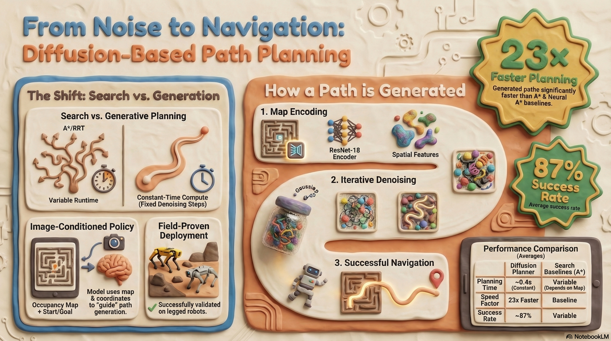

# Diffusion-based 2D Path Planner for Legged Robots

The project is an **image-conditioned diffusion planner** that generates **global 2D trajectories** by **denoising a noisy trajectory sample into a collision-free path**, conditioned on a map image (and optionally start/goal). The repo includes: **data generation (ROS1)**, **training/inference notebooks**, a **standalone showcase (no ROS)**, and a **ROS1 global planner plugin** for deployment.

---

## What problem this solves

Classical planners like A\* / **RRT** can slow down as environments scale and complexity increases. The model instead learns a distribution over feasible trajectories from demonstrations and generates a path with **roughly constant planning time**, independent of trajectory length (once diffusion steps are fixed).

---

## Core idea (high level)

1. **Input**: occupancy/map image `O` (e.g., 100×100 maze) + start/goal  
2. **Initialize**: a trajectory as Gaussian noise (with start/goal “inpainted”)  
3. **Denoise**: run the reverse diffusion process using a CNN noise-prediction network `εθ` conditioned on map features  
4. **Output**: a 2D waypoint sequence connecting start→goal while avoiding obstacles  

Training uses:
- **ResNet-18 visual encoder** to embed the map image  
- **CNN diffusion network** to predict noise at diffusion step `k`  
- **FiLM conditioning** to inject map/start-goal context into the policy  

---

## Repository structure (what’s in here)

- **Files**: end-to-end training + inference + metrics + plots in a standalone folder  
- **Data generation (ROS1 package)**: randomized maze generation + trajectory generation  
- **Training notebook**: diffusion policy training with goal conditioning  
- **Deployment**: ROS1 navigation global planner plugin integration  

---

Dataset pairs:
- **Random solvable maze maps** (generated using **Kruskal MST**)  
- **Feasible expert trajectories** (generated using **A\*** from random start/goal pairs)

---

## Model and training

### Observation and action spaces
- **Observation `O`**: map image (plus optional start/goal coordinates)  
- **Action `At`**: 2D waypoint sequence (trajectory)  

### Training objective
Train `εθ` to predict the noise added at diffusion step `k` using **MSE**:
- Sample a trajectory `A0`
- Add noise `εk`
- Predict noise with `εθ(O, A0 + εk, k)`
- Minimize MSE between true and predicted noise

---

## Results

- **~87% average success rate** (feasible paths) across validation + out-of-distribution maps  
- **~23× faster** trajectory generation than A\*, Neural A\*, and ViT-A\* in benchmark comparisons (constant ~0.4s in their setup)  
- Demonstrated real-world deployment on **Boston Dynamics Spot** and **Unitree Go1**

---

## Citation
- **Reference Paper:** https://rpl-cs-ucl.github.io/DiPPeR/
- **Dataset:** https://huggingface.co/datasets/jianwei-liu93/DiPPeR-Diffusion_2D_planner_training_dataset_example